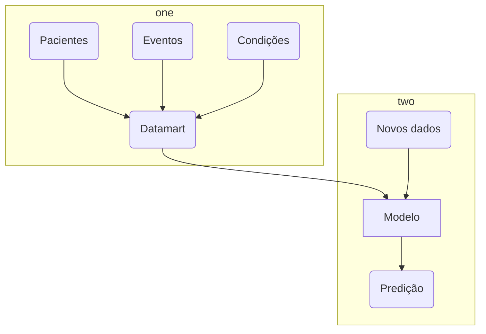

# Ciência de dados em saúde

O presente projeto foi originado no contexto das atividades da disciplina de pós-graduação [*Ciência e Visualização de Dados em Saúde*](https://ds4h.org), oferecida no primeiro semestre de 2022, na Unicamp.

| Nome                     | RA     | Especialização |
| ------------------------ | ------ | -------------- |
| Bruna Osti               | 231024 | Computação     |
| Fabio Fogliarini Brolesi | 023718 | Computação     |
| Ingrid                   | 000000 | Computação     |

# Contextualização da Proposta
> Apresentação da proposta de predição indicando os parâmetros adotados para a mesma com a justificativa (por que esses parâmetros foram adotados?).
> O ideal é que a proposta seja apresentada como uma pergunta de pesquisa.

Com dados de eventos e condições de pacientes a partir dos seus registros disponíveis, é possível predizer o prognóstico de evolução para óbido dentro de $7$ dias?

## Ferramentas
> Listagem das ferramentas utilizadas (na forma de itens).

Para o presente trabalho, utilizamos da tecnologia Python, a partir de desenvolvimento de provas de conceito em notebook e posterior execução de fluxo de dados (data pipeline) através de scripts shell a partir dos dados disponibilizados em arquivos físicos `csv`.

# Metodologia
> Abordagem adotada pelo projeto na predição.
> Justificar as escolhas e (opcionalmente) apresentar fundamentos teóricos.

## Bases Adotadas para o Estudo

> Se só foram usadas as bases fornecidas, basta listá-las como segue:
As bases utilizadas para o presente projeto são as que seguem:
* scenario01
* scenario02

> Se usou também outras bases (opcional), apresentá-las como segue:

| Base de Dados  | Endereço na Web   | Resumo descritivo                                |
| -------------- | ----------------- | ------------------------------------------------ |
| Título da Base | http://base1.org/ | Breve resumo (duas ou três linhas) sobre a base. |

# Resultados Obtidos
> Esta seção pode opcionalmente ser apresentada em conjunto com a metodologia, intercalando método e resultados.
>
> Descreva etapas para obtenção do modelo, incluindo tratamento de dados, se houve.
>
> Apresente o seu modelo de predição e resultados alcançados.
> Para cada modelo, apresente no mínimo:
> * quais os dados sobre o paciente que serão usados para a predição;
> * qual a abordagem/modelo adotado;
> * resultados do preditor (apresente da forma mais rica possível, usando tabelas e gráficos - métricas e curva ROC são bem vindos);
> * breve discussão sobre os resultados obtidos.
>
> Nesta seção, lembre-se das sugestões de análise:
> * analisar diferentes composições de treinamento e análise do modelo:
>   * um modelo treinado/validado no cenário 1 e testado no cenário 2 e vice-versa;
>   * um modelo treinado e validado com os dados dos dois cenários;
>   * nos modelos dos dois itens anteriores:
>     * houve diferença de resultados?
>     * como analisar e interpretar as diferenças?
> * testar diferentes composições de dados sobre o paciente para a predição (por exemplo, quantidade diversificadas de número de itens).

# Evolução do Projeto

> Seção opcional se houver histórico de mudanças e evolução relevantes.
> Relate aqui a evolução do projeto: possíveis problemas enfrentados e possíveis mudanças de trajetória. Relatar o processo para se alcançar os resultados é tão importante quanto os resultados.

A partir dos resultados obtidos, podemos avaliar a possibilidade de evolução do ponto de vista de captar mais dados que possam ser relevantes para a análise e construção de um modelo mais robusto e que possa ter a capacidade de previsão mais acurada, para apoiar a definição do prognóstico médico [...].

# Discussão
> Fazer um breve debate sobre os resultados alcançados. Aqui pode ser feita a análise dos possíveis motivos que certos resultados foram alcançados. Por exemplo:
> * por que seu modelo alcançou (ou não) um bom resultado?
> * por que o modelo de um cenário não se desempenhou bem em outro?
>
> A discussão dos resultados também pode ser feita opcionalmente na seção de Resultados, na medida em que os resultados são apresentados. Aspectos importantes a serem discutidos: É possível tirar conclusões dos resultados? Quais? Há indicações de direções para estudo? São necessários trabalhos mais profundos?

# Conclusão
> Destacar as principais conclusões obtidas no desenvolvimento do projeto.
>
> Destacar os principais desafios enfrentados.
>
> Principais lições aprendidas.
>
> Trabalhos Futuros:
> * o que poderia ser melhorado se houvesse mais tempo?

# Referências Bibliográficas
> Lista de artigos, links e referências bibliográficas (se houver).
>
> Fiquem à vontade para escolher o padrão de referenciamento preferido pelo grupo.