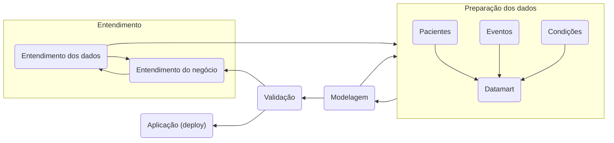

# Relatório Final de Projeto P2 - Ciência de Dados em Saúde

# Projeto de Predição de Prognóstico de Mortalidade com Dados Sintéticos

# Apresentação

O presente projeto foi originado no contexto das atividades da disciplina de pós-graduação [*Ciência e Visualização de Dados em Saúde*](https://ds4h.org), oferecida no primeiro semestre de 2022, na Unicamp e elaborado pelos seguintes alunos:

| Nome                          | RA     | Especialização |
| ----------------------------- | ------ | -------------- |
| Bruna Osti                    | 231024 | Computação     |
| Fabio Fogliarini Brolesi      | 023718 | Computação     |
| Ingrid Alves de Paiva Barbosa | 182849 | Computação     |

# Contextualização da Proposta
> Apresentação da proposta de predição indicando os parâmetros adotados para a mesma com a justificativa (por que esses parâmetros foram adotados?).
> O ideal é que a proposta seja apresentada como uma pergunta de pesquisa.

A área de pesquisa de prognósticos busca entender e melhorar os resultados de prognósticos em pessoas com uma determinada doença ou condição de saúde. O objetivo geral de estudos prognósticos em contextos clínicos é ajudar clínicos, pacientes e familiares a tomar decisões esclarecidas a respeito de cuidados de saúde com base em informações disponíveis sobre cada paciente no presente para prever desfechos no futuro [1]. Além disso, ajuda os pacientes e os familiares a tomar decisões adequadas a respeito do fim da vida daqueles cujo risco de morte é muito alto e a identificar intervenções personalizadas para evitar futuras hospitalizações [2].  
Os modelos prognósticos usam vários fatores em combinação para prever o risco de resultados clínicos futuros em pacientes. Um bom modelo deve (i) fornecer previsões precisas que informam os pacientes e seus cuidadores, (ii) apoiar a pesquisa clínica e (iii) permitir decisões para melhorar os resultados dos tratamentos aos pacientes [1]. Um modelo prognóstico tem três fases principais: desenvolvimento do modelo (incluindo validação interna), validação externa e investigações de impacto na prática clínica. Embora muitos modelos prognósticos sejam propostos, poucos são atualmente usados na prática clínica [1].

A proposta deste projeto é montar um ou mais modelos de prognóstico que realizem a predição de mortalidade de pacientes sintéticos gerados em pelo menos dois cenários de dados fictícios. Será necessário estabelecer os parâmetros de predição, definir quais os dados sobre o paciente que serão usados para a predição, construir modelos de aprendizagem de máquina que realizem predições e apresentar o resultado do modelo de predição aplicado.

Para realizar o prognóstico de forma mais precisa, é importante escolher um cenário específico. Dentre os dados disponibilizados, a equipe optou por trabalhar com os indivíduos que sofrem de Insuficiência Cardíaca Congestiva Crônica (ICC) [3]. Esta condição ocorre porque o coração não tem força para bombear a quantidade necessária de sangue para o corpo, e com a diminuição da circulação muitas funções corporais ficam prejudicadas, pois falta oxigênio. As causas mais comuns da ICC são doenças arteriais coronarianas, infarto, hipertensão arterial, doenças das válvulas cardíacas, diabetes, outras doenças do coração ou doenças congênitas [4].

Diante deste cenário, a pergunta de pesquisa levantada para este projeto é a seguinte:

> Com dados de eventos e condições de pacientes a partir dos seus registros disponíveis, é possível predizer o prognóstico de evolução para óbito de pacientes com Insuficiência Cardíaca Congestiva Crônica dentro de $7$ dias?

## Ferramentas
> Listagem das ferramentas utilizadas (na forma de itens).

Para o presente trabalho, utilizou-se a tecnologia Python, a partir de desenvolvimento de provas de conceito em notebook e posterior execução de fluxo de dados (data pipeline) através de scripts shell a partir dos dados disponibilizados em arquivos físicos `csv`.

# Metodologia
> Abordagem adotada pelo projeto na predição.
> Justificar as escolhas e (opcionalmente) apresentar fundamentos teóricos.

O presente trabalho trata-se de um estudo de caso que utiliza a metodologia CRISP-DM (CRoss-Industry Standard Process for Data Mining), criado pela SPSS Inc [1]. Este modelo é composto de 6 fases, e suas interações podem ser vistas na figura a seguir [1]: 

1. Entendimento do negócio/contexto
2. Entendimento dos dados
3. Preparação dos dados
4. Modelagem
5. Avaliação
6. Aplicação (*Deployment*)

Figura 1: Metodologia CRISP-DM.

A seguir será explicado o objetivo de cada fase, com sua respectiva aplicação para solucionar o problema proposto neste projeto.

## Entendimento do problema (entendimento de negócio)

Dados os cenários sintéticos do [Synthea](https://synthea.mitre.org/) presentes no repositório [Github](https://github.com/santanche/lab2learn/tree/master/data/synthea) especificamente para esta disciplina, utilizamos um conjunto de dados para identificar qual a probabilidade do prognóstico de evolução para óbido dos pacientes cujo encontro foi a partir das causas [TODO: colocar as causas] [TODO: o que mais queremos identificar].

## Entendimento dos dados

Os dados estão presentes em arquivos CSV (*comma separeted values*) e são os seguintes:

* `allergies`
* `careplans`
* `claims`
* `conditions`
* `devices`
* `encounters`
* `imaging_studies`
* `immunizations`
* `medications`
* `observations`
* `organizations`
* `patients`
* `payers`
* `payer_transitions`
* `procedures`
* `providers`
* `supplies`

## Preparação dos dados

Após avaliação do cenário corrente baseado na pergunta ser respondida, foi identificada a necessidade de uso das bases pacientes, eventos e condições [TODO: avaliar se só essas] (do ponto de vista técnico, respectivamente as tabelas em formato CSV de `patients`, `events`, `conditions`). A combinação dos dados de interesse presentes em cada uma das tabelas fornecidas foi feita a partir do vínculo entre elas conforme a Tabela 1, gerando um datamart final para ser utilizado no modelo proposto.

|                  | **`patients`** | **`events`** | **`conditions`** |
| ---------------- | -------------- | ------------ | ---------------- |
| **`patients`**   |                | `patient_id` |                  |
| **`events`**     | `patient_id`   |              | `event_id`       |
| **`conditions`** |                | `event_id`   |                  |

 
Tabela 1: Apresentação do vínculo entre tabelas para criação do datamart a ser utilizado pelo modelo.

Com a estruturação dos dados a partir do cruzamento entre eles, realizou-se a criação de colunas (características, ou, em inglês na área de ciência de dados, *feature*) sintéticas a partir de colunas originas de de dados categóricos para, a partir do aumento da dimensionalidade, trazer maior riquza para a criação do modelo considerando aspectos relevantes para a análise.

Ao final, as colunas relevantes para o desenvolvimento do datamart foram as presentes na Tabela 2:

| **Tabela origem** | **Campo**                 | **Coluna origem**   | **Descrição**                                                      |
| ----------------- | ------------------------- | ------------------- | ------------------------------------------------------------------ |
| ENCOUNTER         | TOTAL_CLAIM_COST          | TOTAL_CLAIM_COST    |
| ENCOUNTER         | ENCOUNTERCLASS_wellness   | ENCOUNTERCLASS      | Classe de encontro marcada como rotineira                          |
| ENCOUNTER         | ENCOUNTERCLASS_urgentcare | ENCOUNTERCLASS      | Classe de encontro marcada como de urgência                        |
| ENCOUNTER         | ENCOUNTERCLASS_snf        | ENCOUNTERCLASS      | Classe de encontro marcada como centro de enfermagem especializada |
| ENCOUNTER         | ENCOUNTERCLASS_outpatient | ENCOUNTERCLASS      | Classe de encontro marcada como ambulatorial                       |
| ENCOUNTER         | ENCOUNTERCLASS_inpatient  | ENCOUNTERCLASS      | Classe de encontro marcada como internação                         |
| ENCOUNTER         | ENCOUNTERCLASS_home       | ENCOUNTERCLASS      | Classe de encontro marcada como domiciliar                         |
| ENCOUNTER         | ENCOUNTERCLASS_emergency  | ENCOUNTERCLASS      | Classe de encontro marcada como emergência                         |
| ENCOUNTER         | ENCOUNTERCLASS_ambulatory | ENCOUNTERCLASS      | Classe de encontro marcada como ambulatorial                       |
| ENCOUNTER         | PAYER_COVERAGE            | PAYER_COVERAGE      |                                                                    |
| PATIENT           | BIRTHDATE                 | BIRTHDATE           |                                                                    |
| PATIENT           | MARITAL                   | MARITAL             |                                                                    |
| PATIENT           | HEALTHCARE_COVERAGE       | HEALTHCARE_COVERAGE |                                                                    |
| PATIENT           | HEALTHCARE_EXPENSES       | HEALTHCARE_EXPENSES |                                                                    |
| PATIENT           | LON                       | LON                 |                                                                    |
| PATIENT           | LAT                       | LAT                 |                                                                    |
| PATIENT           | ZIP                       | ZIP                 |                                                                    |
| PATIENT           | GENDER                    | GENDER              |                                                                    |
| PATIENT           | ETHNICITY                 | ETHNICITY           |                                                                    |
| PATIENT           | RACE                      | RACE                |                                                                    |
| ENCOUNTER         | BASE_ENCOUNTER_COST       | BASE_ENCOUNTER_COST |                                                                    |

Tabela 2: Campos utilizados para composição do datamart a ser considerado para a geração do modelo de aprendizado de máquina. A **coluna origem** indica que o campo foi criado artificialmente de uma *feature* categórica da tabela origem.

Após a criação do datamart, realizou-se a extração de informações relevantes para a análise dos pacientes de interesse considerando apena a condição **[TODO: nome da condição]** para que a partir do modelo, a entrada de dados fosse feita apenas considerando a condição de interesse.

## Modelagem

[TODO: colocar a criação de samples / treino/teste, SVM e decision tree]

## Validação

Os resultados obtidos a partir da análise descritiva, criação e refinamento do modelo são os que seguem:

### Análise descritiva

[TODO: penso em colocar boxplot, outros pontos descritivos de análises iniciais]

### Modelo

Sobre o modelo, utilizou-se a técnica de *Support Vector Machines* afim de identificar a segregação a partir de hiperplanos dos dados em dois: prognóstico de evolução à óbito em até $7$ dias e prognóstico de evolução à óbito igual ou superior a $7$ dias. Dado que a quantidade de registros era pequena, utilizou-se da técnica de *data augmentation* (ou, aumento de dados, a partir da criação de dados sintéticos, baseados nos dados originais), para que as amostras (óbito em até 7 dias e óbito a partir de 7 dias) ficassem balanceadas.

## Aplicação

Uma com o modelo desenhado e validado, realizou-se então o deploy do mesmo, tornando-o produtivo para ser executado no dispositivo final, e a partir daí, o uso do mesmo a partir da entrada de dados conforme estrutura da Tabela 3.

| **Campo** | **Descrição**                |
| --------- | ---------------------------- |
| A         | Identifica o tipo de sintoma |
| D         | Identifica o tempo de vida   |

Tabela 3: Campos utilizados na entrada dos dados para processamento do modelo desenvolvido.

## Bases Adotadas para o Estudo

> Se só foram usadas as bases fornecidas, basta listá-las como segue:

As bases utilizadas para o presente projeto são as que seguem:

* [scenario01](/data/raw/scenario01/)
* [scenario02](/data/raw/scenario02/)

> Se usou também outras bases (opcional), apresentá-las como segue:

| Base de Dados  | Endereço na Web   | Resumo descritivo                                |
| -------------- | ----------------- | ------------------------------------------------ |
| Título da Base | http://base1.org/ | Breve resumo (duas ou três linhas) sobre a base. |

# Resultados Obtidos

> Esta seção pode opcionalmente ser apresentada em conjunto com a metodologia, intercalando método e resultados.
>
> Descreva etapas para obtenção do modelo, incluindo tratamento de dados, se houve.
>
> Apresente o seu modelo de predição e resultados alcançados.
> Para cada modelo, apresente no mínimo:
> * quais os dados sobre o paciente que serão usados para a predição;
> * qual a abordagem/modelo adotado;
> * resultados do preditor (apresente da forma mais rica possível, usando tabelas e gráficos - métricas e curva ROC são bem vindos);
> * breve discussão sobre os resultados obtidos.
>
> Nesta seção, lembre-se das sugestões de análise:
> * analisar diferentes composições de treinamento e análise do modelo:
>   * um modelo treinado/validado no cenário 1 e testado no cenário 2 e vice-versa;
>   * um modelo treinado e validado com os dados dos dois cenários;
>   * nos modelos dos dois itens anteriores:
>     * houve diferença de resultados?
>     * como analisar e interpretar as diferenças?
> * testar diferentes composições de dados sobre o paciente para a predição (por exemplo, quantidade diversificadas de número de itens).

# Evolução do Projeto

> Seção opcional se houver histórico de mudanças e evolução relevantes.
> Relate aqui a evolução do projeto: possíveis problemas enfrentados e possíveis mudanças de trajetória. Relatar o processo para se alcançar os resultados é tão importante quanto os resultados.

A partir dos resultados obtidos, existe a possibilidade de evolução do ponto de vista de utilizar / captar mais dados que possam ser relevantes para a análise e construção de um modelo mais robusto e que possa ter a capacidade de previsão mais acurada, para apoiar a definição do prognóstico médico [TODO: incrementar].

Outra possibilidade é a geração de mais dados sintéticos para, a partir de uma massa de dados maior, termos um modelo com maior robustez.

# Discussão
> Fazer um breve debate sobre os resultados alcançados. Aqui pode ser feita a análise dos possíveis motivos que certos resultados foram alcançados. Por exemplo:
> * por que seu modelo alcançou (ou não) um bom resultado?
> * por que o modelo de um cenário não se desempenhou bem em outro?
>
> A discussão dos resultados também pode ser feita opcionalmente na seção de Resultados, na medida em que os resultados são apresentados. Aspectos importantes a serem discutidos: É possível tirar conclusões dos resultados? Quais? Há indicações de direções para estudo? São necessários trabalhos mais profundos?

# Conclusão
> Destacar as principais conclusões obtidas no desenvolvimento do projeto.
>
> Destacar os principais desafios enfrentados.
>
> Principais lições aprendidas.
>
> Trabalhos Futuros:
> * o que poderia ser melhorado se houvesse mais tempo?

# Referências Bibliográficas
> Lista de artigos, links e referências bibliográficas (se houver).
>
> Fiquem à vontade para escolher o padrão de referenciamento preferido pelo grupo.

[1] https://www.scielo.br/j/jbpneu/a/4v6FmcMGxnnSpCmJ3dZZrbG/?format=pdf&lang=pt
[2] https://journals.plos.org/plosmedicine/article?id=10.1371/journal.pmed.1001381
Steyerberg EW, Moons KG, van der Windt DA, Hayden JA, Perel P, Schroter S, et al. Prognosis Research Strategy (PROGRESS) 3: prognostic model research. PLoS Med. 2013;10(2):e1001381. https://doi.org/10.1371/journal.pmed.1001381
[3] https://www.findacode.com/snomed/88805009--chronic-congestive-heart-failure.html?hl=88805009
[4] https://wippesaude.com.br/2018/06/12/o-que-e-o-icc-insuficiencia-cardiaca-cronica-congestiva/
